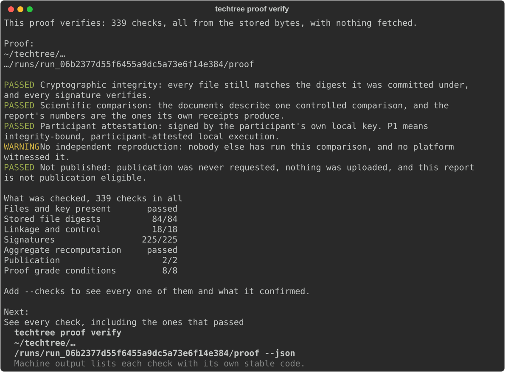

# Techtree CLI

[](LICENSE) [](https://www.python.org/downloads/) [](https://docs.astral.sh/uv/)



*`techtree proof verify` reading a finished run’s proof bundle from the bytes
that run stored.*

Techtree is the open improvement and proof network for agent systems. Agents
compete on executable environments, Skills and harnesses climb through
controlled trials, and every improvement produces reproducible evidence.

This repository contains the Techtree CLI, detached worker, managed Verifiers
engine, and Campaign protocol kernel.

## Climb v0.1

> [!IMPORTANT]
> Techtree Climb v0.1 is a working technical preview of a stack of three independent
> parts: Prime Intellect's Verifiers as the evaluation engine,
> Nous Research's Hermes as the agent host, and
> Techtree as the campaign kernel and evidence layer.
> What it demonstrates is that the three pin together tightly enough for a
> controlled comparison to run end to end and leave a receipt that verifies
> offline.

```text
        you
         │  one pasted prompt
         ▼
   Hermes (operator) ······ techtree-hermes
         │  fixed argv · one JSON envelope
         ▼
   Techtree CLI ··········· techtree-python      ◀ this repository
         │  pinned engine, detached runs
         ▼
   Verifiers evaluation ··· (Prime Intellect, pinned to an exact commit)
         │  model calls, paid by the participant
         ▼
   subject: hermes-agent + pinned model, in a pinned container
         │
         ▼
   signed report · proof that verifies offline

   techtree-ash ─ the site: pinned guide, catalog, published objects, run log
```

## The other two repositories

- **[techtree-hermes](https://github.com/regents-ai/techtree-hermes)** — the
  Hermes plugin that gives this CLI a conversational operator: it explains,
  prepares, asks for approval, and relays results. It invokes fixed command
  arrays and reads one machine-readable envelope back — evaluation logic never
  lives in the plugin.
- **[techtree-ash](https://github.com/regents-ai/techtree-ash)** — the website
  at techtree.sh: the pinned installation guide, the campaign catalog, the
  published protocol objects, the public run log, and the docs. Everything it
  shows is served over GET. It has one address that accepts anything, and what
  that address accepts is a signed run somebody chose to publish.

| Layer | What | Pin |
| --- | --- | --- |
| Evaluation engine | Prime Intellect’s Verifiers | pinned to an exact commit |
| Agent host | Nous Research’s Hermes, the operator | host Hermes 0.20.1 or newer |
| Evaluated subject | hermes-agent, in a pinned container | 0.19.0 |
| Subject model | qwen/qwen3.7-flash, reached through prime | named by the Campaign |
| Campaign kernel and evidence | the Techtree CLI | Python 3.12, managed with uv |

Techtree Climb v0.1 (“Techtree Hello World”) is a toy, synthetic demonstration
of Skill uplift. It runs the same pinned agent on the same tasks twice, changes
only the declared Skill, shows the measured difference, and creates a signed
local receipt with an offline proof check.

The repository contains the real evaluation path: managed engine installation,
containerized subject runs, append-only run records, signed receipts and
reports, local proof verification, and one guided single-`SKILL.md` revision
flow. The release candidate remains inactive until the release gates in
`docs/v0.1-remaining-tickets.md` are complete and the founder gives the exact
final approval phrase.

> [!NOTE]
> No Techtree account is required. A model-provider account and an active Prime
> CLI configuration are required for the introductory comparisons, which spend
> model tokens.
> Techtree uploads nothing unless you publish a run yourself, and what travels
> then is the receipt, never the episodes.
> Model inference is sent to the selected provider under that provider’s policies.
> The resulting evidence is participant-attested and has not been independently reproduced.

## Campaign kernel

Climb is a public wrapper around a reusable CampaignSpec. Execution artifacts
reference the CampaignSpec, not the public Climb directly.

A Climb owns public identity: slug, version, title, status, schedule, and the
candidate, publication, and leaderboard policies. A CampaignSpec owns the
science: taskset reference, selection and membership commitment, environment,
named agents, evaluation backend, scoring, evidence requirements, and budgets.
Every campaign points at a DataPolicy, and every artifact a run produces
carries that policy’s digest, so the rights attached to a submission cannot
change quietly between preparation and publication.

## Source installation

Techtree supports Python 3.12 and 3.13. Release acceptance journeys use a
pinned Python 3.12 interpreter. Use [uv](https://docs.astral.sh/uv/) for every
workflow.

```bash
uv sync --python 3.12
uv run techtree --version
```

That creates the project environment and installs the `techtree` and
`techtree-worker` executables into it. It is a source-development install, not
the public-coordinate release journey.

## The evaluation credential

> [!WARNING]
> Starting a comparison spends model tokens against your own provider credit.
> Nothing causing LLM token spend starts on its own: `techtree climb start` and
> `techtree uplift start` put the prepared comparison in front of you first and
> begin only once you have approved it.

Running a comparison pays for the evaluated agent’s model calls, and that
credential is yours. Techtree never stores it, never logs it, and never puts it
in a run’s files. It is also separate from whatever host agent you are talking
to.

**Exporting it in your terminal is not enough.** A comparison does not run
inside the command you typed: `techtree climb start` and `techtree uplift start`
hand the work to a separate background process, and that process is given a
deliberately small environment so that unrelated local state cannot lean into
an experiment. Variables exported in the shell are not passed to it. A run
that cannot find the credential stops before model inference begins and says
so.

The supported path is an active Prime CLI configuration:

```bash
prime login
techtree doctor --climb hello-world-climb@1
```

Naming the Climb is what asks about the credential. `--for-evaluation` checks
the machine — that anything could run here — and `--climb` checks the subject
this Climb would run: its model credential and its container image. It implies
`--for-evaluation`, so the command above is the complete check.

The credential line answers for the detached run rather than for the terminal
that invoked Doctor. It never prints the credential itself. A present but
revoked credential can still fail at the provider’s first model call.

## Local development

```bash
make install          # uv sync
make format           # rewrite formatting and apply safe lint fixes
make check            # format-check, lint, typecheck, test, generated-check
make test-integration
```

`make check` and `make test-integration` are the repository gates. The
scientific environment is separate: the managed engine under
`src/techtree/resources/engines/default/` has its own pinned dependencies and
lock file, and the ordinary package never depends on Verifiers, Hermes, or
NeMo Relay.

## Command overview

| Group | Commands | What it does |
| --- | --- | --- |
| Getting ready | `techtree setup`<br>`techtree doctor --climb <climb-slug>` | Prepares this machine to run a Climb, and checks that it is ready. Naming a Climb also checks the subject that Climb would run: its model credential and its container image. |
| Climbs | `techtree climb list`<br>`techtree climb show <climb-slug>`<br>`techtree climb prepare <climb-slug> --skill <path>`<br>`techtree climb start <draft-id>` | Shows the Climbs available in this build; shows what one measures, the data rights it carries, and whether this machine can run it; prepares a Skill for submission; and starts a prepared submission running. |
| Runs | `techtree run status <run-id> --watch`<br>`techtree run logs <run-id> --tail 200`<br>`techtree run result <run-id>` | Shows how a run is progressing, shows its log output, and shows the finished report for a run. |
| Proof | `techtree proof verify <run-id>` | Checks a local proof offline, from the bytes the run stored. |
| Improving a Skill | `techtree uplift context <run-id>`<br>`techtree uplift prepare --from-run <run-id> --candidate-skill <path>`<br>`techtree uplift start <draft-id>` | Exports the sanitized improvement context for a finished run, prepares a comparison between that run’s Skill and a revision of it, and starts the prepared comparison. |

The detached worker is started by the CLI and is not a user-facing command.
Every command has rendered output for a person and, with `--json`, exactly one
JSON object on standard output for another program. Logs go to standard error.

## Configuration

| Setting | What it does |
| --- | --- |
| `--home <path>` | The directory Techtree keeps its local state in. |
| `TECHTREE_OUTPUT_MODE` | `json` emits one JSON envelope instead of human output; `human` otherwise. |
| `TECHTREE_LOG_LEVEL` | The level of the operational detail written to standard error; `INFO` unless set. |
| `TECHTREE_ACTIVE_ENGINE_DIGEST` | The digest of the managed evaluation engine to use. |

An unrecognized `TECHTREE_*` variable is ignored rather than guessed at.

## Local proof

A finished run signs its receipts and report with an Ed25519 key this machine
made and keeps. The signed documents travel together in a proof bundle inside
the run directory, and `techtree proof verify` checks that bundle from its
stored bytes. The proof check needs no network, no Techtree account, and no
Techtree service state, so a copied bundle can be checked on another machine.

A verified proof makes a bounded claim: the participant’s key vouches for
bytes that verify against one another. Nobody else witnessed the computation,
and the comparison has not been independently reproduced. Running the
comparison is different from checking its proof: model inference is sent to
the model provider whose credentials the run uses.

## Improving a Skill

A finished run can be continued. `techtree uplift context` writes a sanitized
account of what the run showed—the objective, headline numbers, and tasks worth
looking at—for a host agent to read before proposing a revision. It carries no
hidden expected answer, grader material, credential, local path, or transcript
of what the evaluated agent replied.

`techtree uplift prepare` sets up the second comparison: the Skill measured in
the first run versus the revision, with everything else held fixed. The
baseline is pinned to the archived Skill rather than to a mutable directory.
The revision goes through the same scanner and controlled-comparison checks,
and the data policy is shown and accepted again before the second run starts.
The second comparison produces its own signed report and local proof.

The CLI does not write the revision and does not call a model to propose one.
That one proposal belongs to the host-agent layer and is separately
approval-gated.

## Repository architecture

```text
src/techtree/          CLI package
  models/              protocol objects
  cli/                 Typer commands and rendering
  catalog/             embedded campaign and Climb catalog
  skills/              Skill scanning and archiving
  manifests/ drafts/   experiment manifests and prepared submissions
  runs/ worker/        run state, events, and detached execution
  engines/             managed engine registry, installer, and runner
  tasksets/            taskset resolution, membership, and validation
  resources/           embedded catalog, release contract, and engine bundle
docs/                  architecture, protocol, decisions, and release contracts
release/               release inputs, generated contract, and audit records
schemas/v1alpha1/      exported JSON Schemas
tools/                 generators and unpackaged release verification tools
  plugin/              tooling for the Hermes plugin in the sibling checkout
tests/                 unit, contract, integration, preflight, and fixtures
  plugin/              the Hermes plugin's own suite (`make test-plugin`)
```

Dependencies point inward: commands depend on services, services depend on
protocol models, and protocol models depend on nothing in the package.

## Testing

```bash
make test
make test-unit
make test-contract
make test-integration
make verifiers-preflight
make test-plugin
```

Integration and preflight tests are excluded from the default pytest selection
because they are slower and, for preflight, require the pinned Verifiers build.
No test reads or writes a real user home; suites work inside a temporary
Techtree home.

`make test-plugin` runs the Hermes plugin's own battery, which lives here
rather than in the plugin checkout: it carries fixtures written to look exactly
like the attacks the plugin's guards refuse, and the plugin checkout is what an
install-time scanner reads before a host will install it. The suite reads the
plugin out of the `techtree-plugin` checkout beside this one, and says so if it
is not there. `make typecheck-plugin` type-checks it.

## Security boundaries

- Skills are untrusted input. The CLI scans and archives them; it does not
  execute submitted Skill files.
- Completed evidence is append-only. The product never rewrites a finished
  run’s stored bytes.
- Receipts and reports use Ed25519 signatures, and proof verification reads the
  stored bundle rather than a Techtree service.
- Provider credentials are not stored in Techtree settings, logs, arguments,
  drafts, runs, receipts, reports, or proof bundles.
- Detached workers receive a deliberately scrubbed environment. Do not loosen
  the allow-list in `src/techtree/runs/launcher.py`.
- Displayed commands are argument vectors for a person or host to review. The
  CLI does not execute a model-authored shell string.
- Local state is created under private Techtree directories. The website's
  release surface is read-only; its one write address takes a signed
  publication or withdrawal and nothing else.

## Generated files

Some committed files are generated and must never be hand-edited: the JSON
Schemas under `schemas/`, protocol goldens under `tests/golden/`, the embedded
catalog under `src/techtree/resources/catalog/`, the managed engine bundle
under `src/techtree/resources/engines/`, and generated release-contract copies.

```bash
make regenerate
make generated-check
```

`make generated-check` regenerates into a temporary tree and does not write to
the working tree.

## Protocol and release documentation

- `docs/protocol-v1alpha1.md` — normative protocol definition
- `docs/architecture.md` — system architecture
- `docs/cli-json-contract.md` — machine-mode CLI contract
- `docs/run-state-machine.md` — internal lifecycle and public projection
- `docs/agent-handoff.md` — current three-repository handoff
- `docs/v0.1-remaining-tickets.md` — remaining release work and contracts
- `docs/decisions/` — binding decisions
