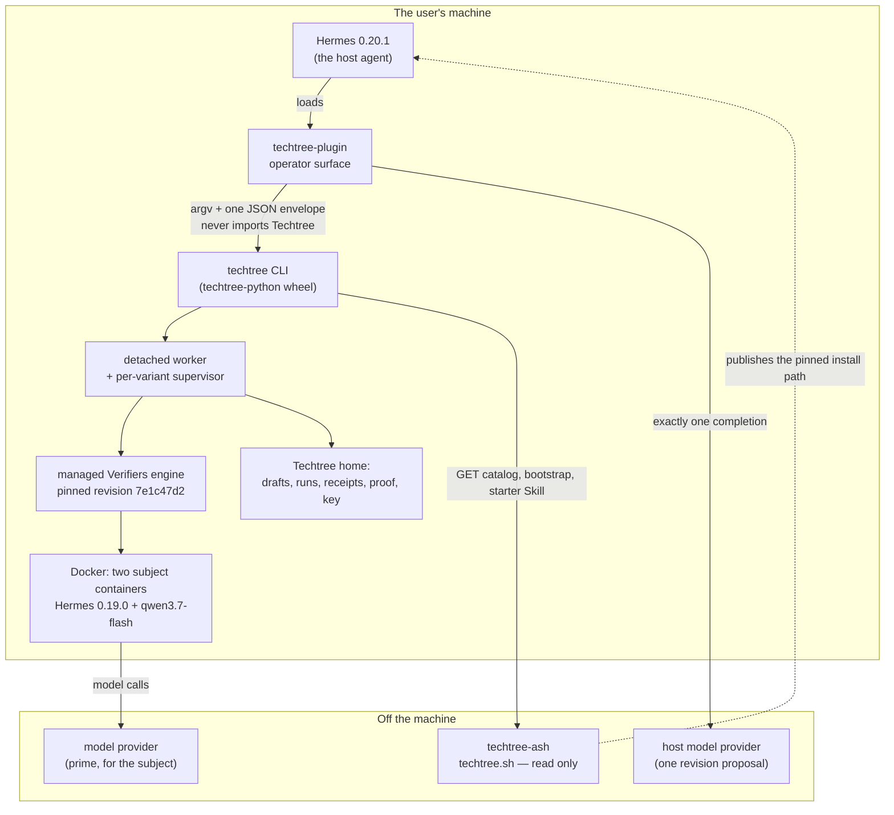
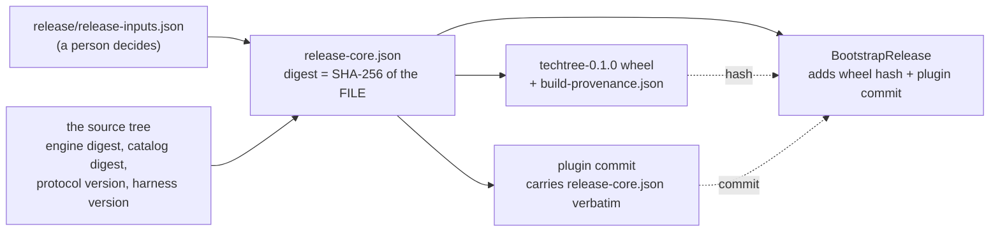
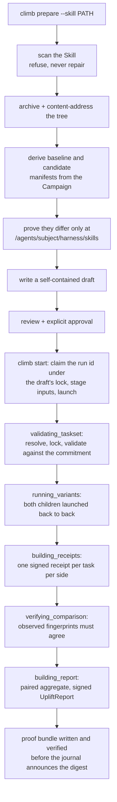
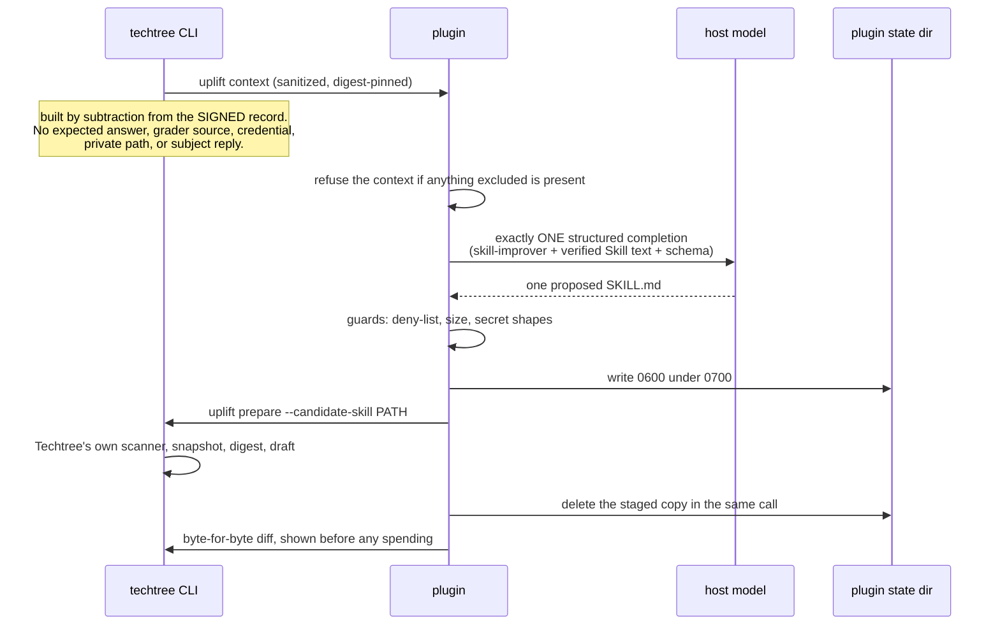
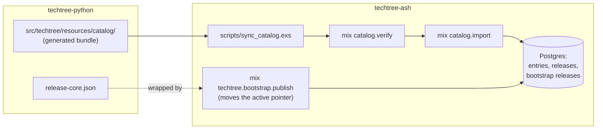

# Product and architecture — a handoff for a new engineer

Read this to learn **what Techtree Climb is**, **how the three codebases are
built**, and **how they fit together**. It is deliberately descriptive rather
than normative.

Two neighbouring documents do different jobs, and this one does not repeat
them:

- `docs/agent-handoff.md` — the current rules and state: binding sources,
  frozen digests, change discipline, invariants, release coordinates. When it
  and this document disagree about a *rule*, that one wins.
- `docs/spec/INDEX.md` — the ticket-to-spec-section map. When you need to know
  which specification section governs a piece of work, go there.

Everything below is checkable from the three checkouts. Every module named
exists. Digests, versions and coordinates change; verify them from artifacts
rather than from prose (here or anywhere else).

---

## 1. Product overview

### 1.1 What Techtree is

Techtree is **the open improvement and proof network for agent systems**.
Agents compete on executable environments; Skills and harnesses climb through
controlled trials; every improvement produces reproducible evidence.

**Techtree Climb v0.1 — "Techtree Hello World"** is the first slice of that,
and it is a *toy Skill-uplift Climb*. It exists to make one mechanism visible
and honest end to end, not to measure anything anybody should act on. It runs
the same pinned agent over the same fixed 36 synthetic tasks twice, changes
only the declared Skill, shows the measured difference, and leaves a signed
local receipt that can be checked offline.

### 1.2 The four-statement public promise

The whole product surface reduces to four statements (decision 0019 §3). Every
mechanism in all three repositories exists to make one of them true:

1. **Same agent and same tasks.** Same model, harness, runtime, task
   membership, tools, scorer and budget on both sides.
2. **The Skill was the only change.** First comparison: no tested Skill →
   Skill v1. Later: Skill v1 → Skill v2. The Skill is a content-addressed
   *tree*, not a single file.
3. **Here is the measured difference.** Baseline score, candidate score,
   absolute uplift, wins/losses/ties, cost, timing, regressions, validity.
4. **Here is the local receipt and how to verify it.** `techtree proof verify`
   — integrity-bound, participant-attested, offline-verifiable, and explicitly
   *not* independently reproduced.

The corollary is a design rule you will feel everywhere: an ordinary user
never has to meet a CampaignSpec, a TasksetLock, a receipt-set manifest,
canonical JSON, a signature envelope, or a journal event kind. Rigor stays
internal; the user experience stays almost trivial.

### 1.3 The vocabulary, as a user meets it

| Word | What it is to a user | Where it lives in code |
| --- | --- | --- |
| **Climb** | A public invitation: a slug, a title, a window, and the rules you are agreeing to. `hello-world-climb@1`. | `models/climb.py` (`ClimbManifest`), catalog |
| **Campaign** | The science behind a Climb: which tasks, which agent, which comparison rules, which budgets. Users never see it; every execution artifact points at it. | `models/campaign.py` (`CampaignSpec`) |
| **Skill** | A small tree of instruction text — `SKILL.md` plus optional `references/` and similar — that the evaluated agent is handed. Content-addressed. | `models/skill.py`, `skills/` |
| **Run** | One comparison: two variants executed, evidence retained, a report produced. Runs detached; survives the terminal closing. | `runs/`, `worker/` |
| **Receipt** | One signed record per task per side, saying what that task scored. | `models/episode_receipt.py`, `receipts/` |
| **Report** | The `UpliftReport`: the paired aggregate and the five statuses that qualify it. | `models/uplift_report.py`, `receipts/uplift.py` |
| **Proof** | A portable directory inside the run that holds the signed documents and can be checked offline with no network, no account and no service. | `receipts/bundle.py`, `receipts/verify.py` |

A **proof** makes a bounded claim, and the product says so in every channel:
this machine's own key vouches for bytes that verify against one another.
Nobody else witnessed the computation.

### 1.4 The two user journeys

**Agent-first (the reference path, decision 0024).** Someone who already uses
Hermes pastes one instruction into it. Hermes reads the pinned installation
guide at `techtree.sh/start`, explains prerequisites, commands, cost and
privacy, asks before installing anything, installs and enables the Techtree
Hermes plugin, tells the user to restart Hermes once, then — through the
plugin — offers to install the pinned Techtree CLI, runs Doctor, and starts
Hello World only after the paid-run approval.

**Direct terminal.** Someone installs the CLI themselves, runs
`techtree setup`, `techtree doctor --climb hello-world-climb@1`,
`techtree climb prepare`, reviews what the run would do, types `y`, and
watches it. Same runs, same receipts, same proof. The plugin is an operator
convenience, never a second evaluation path.

Both journeys hit the same four approvals: install software · first paid run ·
send the sanitized revision context to the host model provider · second paid
run after reviewing the diff.

### 1.5 What is deliberately *not* in v0.1

- **No accounts.** There is no Techtree account, no sign-in, no identity
  service. The only key involved is one this machine made for itself.
- **No uploads.** No receipt, episode, trace, proof or Skill proposal leaves
  the machine. `push=false` is spelled as a type the config cannot hold
  otherwise (`verifiers/config.py`). The website is read-only and has no
  ingest route at all.
- **No leaderboards.** The Climb's leaderboard policy is `enabled: false`, and
  `techtree-ash` runs no ranking of any kind.
- **No multi-file guided revision.** The guided revision proposes one
  `SKILL.md` (decision 0023 §4). Skills themselves are multi-file trees; the
  *guided* revision is not. Multi-file revision is deferred (ticket
  ndq.3.42).
- **No phone or iOS app.** Decision 0024 removed it. The compact renderer
  still exists for narrow channels, but no phone journey is claimed or
  certified.

Model inference still goes to the model provider you configured, under that
provider's policies. "Runs locally" is not "runs without the network", and the
copy is careful about that everywhere.

---

## 2. Tech stack

### 2.1 techtree-python — the CLI and evaluation substrate

| | |
| --- | --- |
| Language | Python 3.12–3.13 (`>=3.12,<3.14`); release journeys pin 3.12 |
| Packaging | `uv` for every workflow; `hatchling` build backend; wheel `techtree-0.1.0` |
| Runtime deps | `pydantic` v2 (protocol models), `typer` (CLI), `rich` (terminal rendering), `rfc8785` (canonical JSON), `cryptography` (Ed25519), `filelock`, `platformdirs`, `tomli-w` |
| Dev tooling | `ruff` (format + lint), `mypy --strict`, `pytest` with `pytest-xdist` and `pytest-cov` |
| Gates | `make check` = format-check, lint, typecheck, test, generated-check. Plus `make test-integration`. |

The ordinary package **never** depends on Verifiers, Hermes or NeMo Relay.
Those belong to the managed engine, which has its own interpreter, its own
`pyproject.toml` and its own `uv.lock` under
`src/techtree/resources/engines/default/`.

### 2.2 techtree-plugin — the Hermes operator plugin

| | |
| --- | --- |
| Language | Python 3.12+, **standard library only** at runtime |
| Distribution | Not a package. Hermes loads the repository directory itself; `[tool.uv] package = false` |
| Dev tooling | `ruff`, `mypy --strict` |
| Gates | `make check` here (format, lint, types); the *tests* run from techtree-python as `make test-plugin` |

The runtime never imports Techtree's Python package. The CLI's JSON envelope
is the only boundary, and `tools/plugin/plugin_doctor.py` fails the build if
either of those two facts stops being true.

### 2.3 techtree-ash — the read-only website

| | |
| --- | --- |
| Language | Elixir ~> 1.15 (developed on 1.19.5 / OTP 28.2) |
| Framework | Phoenix 1.8.4 with LiveView 1.1, Bandit, `phoenix_html` |
| Data | Ash 3 + AshPostgres 2 over PostgreSQL 14+ |
| Assets | esbuild, hand-written CSS, no framework, no remote fonts |
| Deployment | Fly.io (`fly.toml`, app `techtree-sh`), multi-stage `Dockerfile`, OTP release with `bin/server` and `bin/migrate` overlays |
| Gates | `PGUSER="${PGUSER:-postgres}" mix check` — formatting, warnings-as-errors, tests |

### 2.4 The pinned external systems

These are the things the science depends on and the reason nothing here is
allowed to float:

- **Prime Verifiers engine** — pinned to revision
  `7e1c47d24d055aae587ee8259f77a3e8e193513a` (version `0.3.1.dev21`), Python
  3.12, carrying the `procedure-transfer-v1` reference package. The whole
  bundle is content-addressed and installed into
  `<techtree home>/engines/sha256-<hex>/`. Two field notes drive a lot of the
  integration code and are worth reading before touching it:
  `docs/verifiers-pin.md` and `docs/verifiers-eval.md`.
- **Docker subject containers** — the evaluated agent runs in a container the
  Campaign pins by index digest, with per-platform manifest digests recorded
  for `linux/amd64` and `linux/arm64`, `network_policy: restricted`, 2 CPU,
  4 GB. `verifiers/image.py` asks the local daemon what it actually holds
  rather than trusting the reference.
- **Subject model** — `qwen/qwen3.7-flash` via the `prime` provider,
  temperature 0, `max_tokens` 4096, credential named `PRIME_API_KEY` and
  resolved from an **active Prime CLI configuration** (`prime login`). An
  exported shell variable deliberately does not reach a detached run.
- **Host model for the guided revision** — the reference host is
  `z-ai/glm-5.2` with strict `json_schema`, one completion, no retries, no
  fallback (decision 0018). It is a *candidate producer*, never a Campaign
  component: it appears in operational records and provenance, never in the
  TasksetLock, the subject manifest, the comparison invariants or the reward
  contract.
- **Hermes** — host floor and ceiling `0.20.1`, installed with
  `plugins install --ref <full commit>`; Hermes scans the plugin's source
  before installing and shows the findings. The *evaluated subject* stays the
  separately pinned Hermes `0.19.0` named by the Campaign. Those two are not
  the same agent and must never be conflated.

---

## 3. File structure, repository by repository

### 3.1 techtree-python

```text
src/techtree/
├── canonical.py        RFC 8785 canonical JSON; the ONE place an object becomes
│                       bytes for hashing. Also the narrow Verifiers task-hash
│                       normalization boundary.
├── crypto.py           Ed25519 primitives only. Knows nothing about where keys
│                       live or when to sign.
├── ids.py              Prefixed local identifiers (run_…, draft_…). Labels, never
│                       integrity values.
├── constants.py        Values only; imports nothing, so anything may import it.
├── errors.py           The typed error taxonomy, each with a stable code, an exit
│                       code, retryability, and the repair actions to offer.
├── fs.py               Atomic writes, O_EXCL immutable writes, 0600/0700 privacy.
├── paths.py            Where the Techtree home is; creates nothing at import.
├── settings.py         config.toml plus TECHTREE_* overlay. Holds no secret.
├── harness.py          The pinned harness's tool-surface conformance fixture, so a
│                       moved harness pin fails instead of hiding inside "the Skill
│                       index changed".
├── version.py          Package / protocol / CLI-schema versions.
│
├── models/             The protocol kernel. Frozen, strict, extra-forbidden.
│   ├── base.py             ProtocolModel (frozen, hashable) vs StateModel (mutable).
│   ├── campaign.py         CampaignSpec — the scientific contract.
│   ├── climb.py            ClimbManifest + ResolvedClimb — the public wrapper and
│   │                       the assembled, cross-checked graph.
│   ├── data_policy.py      Rights, fixed before any episode exists.
│   ├── skill.py            SkillArtifact (content-addressed tree) + SubmissionDraft.
│   ├── experiment.py       ExperimentManifest ×2 and their comparison.
│   ├── validation.py       TasksetLock, TasksetValidationReceipt, execution record.
│   ├── episode_receipt.py  What one task produced.
│   ├── uplift_report.py    The result, with five separate statuses.
│   ├── run.py              RunRequest, RunPhase, RunEvent, RunState.
│   ├── evaluation_backend.py  Who orchestrated and whose word the result rests on.
│   ├── engine.py           The managed engine descriptor and host-platform vocabulary.
│   ├── catalog.py          Catalog index, Climb summary, compatibility result.
│   └── cli.py              CliEnvelope, CliError, NextAction.
│
├── catalog/            repository.py recomputes every digest before trusting a file
│                       and refuses paths that escape the root; service.py assembles
│                       Climb + Campaign + DataPolicy + validation receipt into one
│                       consistent story and reports whether you could run it here.
├── drafts/             store.py owns the draft directory (self-contained: everything
│                       needed to check the claim is copied in, nothing is left as a
│                       reference into the catalog); source.py is CampaignSource, the
│                       "with or without a public Climb" carrier.
├── manifests/          builder.py derives the two variants from one Campaign by
│                       copying deeply and deciding nothing; compare.py proves the
│                       two differ only at /agents/subject/harness/skills.
├── skills/             policy.py (what a Skill may be), scanner.py (refuses rather
│                       than repairs: symlinks, hidden files, binaries, credential
│                       shapes), archive.py (deterministic tar and a safe extractor),
│                       service.py (directory → prepared submission, in an order
│                       where nothing lands until every check passed),
│                       starter.py (obtain the release's starter Skill and prove it).
├── tasksets/           resolver.py locks a taskset by inspecting it twice in fresh
│                       processes; membership.py turns that into an ordered hash
│                       commitment; verifiers_cli.py drives the pinned validator and
│                       refuses to read a verdict off an exit code; provider.py runs
│                       the real model-free validation; service.py compares identity
│                       and soundness.
├── engines/            bundle.py (what the engine is and what it hashes to),
│                       installer.py (uv sync --frozen; recorded installed only after
│                       the environment answers correctly), registry.py (which engine
│                       is active, addressed by digest), runner.py (absolute paths,
│                       minimal environment).
├── verifiers/          The real evaluation path.
│   ├── config.py           The allow-list of Verifiers settings Techtree may emit.
│   ├── compiler.py         Manifest → deterministic TOML; translation, no judgement.
│   ├── child.py            One live eval child: absolute executable, stdout to a
│   │                       file (never streamed — those are the subject's
│   │                       transcripts), gentle signals to the process group.
│   ├── supervisor.py       A process that outlives the worker, holding a pipe, a
│   │                       monotonic deadline and the eval's process group, so a
│   │                       hard-killed worker cannot orphan spending containers.
│   ├── credentials.py      Checks the evaluation credential without ever carrying it.
│   ├── budget.py           Refuses a Campaign whose declared limits are not
│   │                       enforceable, and computes the dollar bound before starting.
│   ├── image.py            Asks the daemon what it actually holds.
│   ├── progress.py         Counts completed episodes from traces.jsonl. Line position
│   │                       is never task position.
│   ├── outputs.py          The three files a real eval must leave behind.
│   ├── verify.py           The engine's own dry run, compared as a projection.
│   └── models.py           Local execution types and RunPaths.
├── runs/               events.py (append-only canonical journal), machine.py (pure
│                       state machine and projection), store.py (placement, locking,
│                       once-only writes), artifacts.py (run-owned inputs copied and
│                       re-verified), service.py (the start transaction),
│                       launcher.py (detached session leader, scrubbed environment),
│                       executor.py (the seam), fake.py (development executor whose
│                       output can never pass as evidence), real.py (the executor that
│                       measures), variants.py (both sides launched back to back),
│                       child_registry.py, validation.py.
├── worker/             main.py — one argument, no CLI apparatus; execute.py — the
│                       only code running in the detached process.
├── receipts/           episode.py (one receipt per committed task), set.py (ordered
│                       commitment per variant), observed.py (what the engine and the
│                       daemon actually did), compare.py (the two executions were one
│                       experiment), uplift.py (paired aggregate and the report),
│                       execution.py (timing and cost, orthogonal to reward truth),
│                       bundle.py (the portable proof), verify.py (offline check, in
│                       the specification's fixed order).
├── presentation/       models.py (the channel-neutral payload), build.py (signed
│                       report → payload, describing rather than deciding), rich.py
│                       (the terminal rendering), compact.py (the bounded rendering),
│                       evidence.py (reads model turns and provider refusals back out
│                       of the run's unsigned evaluation output, and only after
│                       checking those files against the fingerprints the signed
│                       record already committed — a file that is missing or altered
│                       yields no number rather than a zero), sanitize.py (enforces
│                       that no hidden answer, grader source, credential or private
│                       path can appear).
│                       Everything the screen adds beyond the signed report — the
│                       derived cost, the turn counts, the rate-limit tally — is
│                       computed at render time. The signed report, the receipts and
│                       the proof bundle are never rewritten to carry it.
├── uplift/             derive.py (turn a finished comparison into the next Campaign:
│                       exactly two things change), context.py (what a host agent may
│                       be told — built by subtraction from the signed record),
│                       public_tasks.py (per-taskset disclosure policy; absence is the
│                       safe answer), source.py (the run's own re-verified Skill text),
│                       service.py (the stage that closes a real run).
├── cli/                app.py (wiring and global options), context.py (machine mode
│                       is derived and implies --no-input), invoke.py (one envelope,
│                       one exit code, always), output.py (JSON to stdout, logs to
│                       stderr), commands/{setup,doctor,climb,skill,run,proof,uplift,
│                       engine,release}.py.
├── doctor/             checks.py (one function per thing that can be wrong; nothing
│                       raises), execution_checks.py (the narrower, expensive question:
│                       could the next real run execute here), service.py (order,
│                       blocking, and at most three repairs).
├── identity/           store.py (the one place a key lives, created exclusively),
│                       service.py (sign, and verify against a supplied key),
│                       models.py.
├── release/            models.py (ReleaseCore — every coordinate concrete),
│                       document.py (the one spelling and the file-bytes digest),
│                       generate.py (bind founder inputs to facts read out of the
│                       tree), checks.py (passed / failed / skipped, never two
│                       verdicts), bootstrap.py (check the website's wrapper from the
│                       producing end), provenance.py (read back the build stamp).
└── resources/          catalog/, engines/default/, harness/, release/ — the embedded,
                        generated payload the wheel carries.
```

**Tests.**

```text
tests/
├── unit/           62 files. Model laws, canonical bytes, the state machine table
│                   edge by edge, scanner refusals, verifiers config/compiler/
│                   credentials/budget/supervisor, release models and checks.
├── contract/       The boundaries: CLI envelope and machine mode, exported JSON
│                   schemas, protocol goldens, catalog object graph, release
│                   artifacts and release CLI, and the copy guards
│                   (test_release_copy.py, test_release_readme_truth.py).
├── integration/    Marked `integration`; real filesystem and subprocess flows —
│                   prepare, start, cancel, logs, process survival, concurrency,
│                   sign-and-verify, taskset validation, engine install. Two are
│                   marked `real_model` and spend money: test_real_variant_run.py
│                   and test_real_concurrent_comparison.py.
├── preflight/      Marked `preflight`; pinned-Verifiers compatibility, the subject
│                   image pin, and the taskset contract. `make verifiers-preflight`.
├── golden/         Generated protocol goldens — never hand-edited.
├── fixtures/       Catalogs, campaigns, skills (valid and deliberately invalid),
│                   recorded receipts, drafts, runs, verifiers evidence.
└── plugin/         The Hermes plugin's OWN battery — unit, contract, integration,
                    fixtures. It lives here, not in the plugin checkout, because it
                    carries fixtures written to look exactly like the attacks the
                    plugin's guards refuse, and the plugin checkout is what an
                    install-time scanner reads. `make test-plugin`.
```

**Tools.**

```text
tools/
├── build_engine_bundle.py     regenerate the managed engine bundle
├── build_fixture_catalog.py   install the engine into a throwaway home and run the
│                              real model-free validation to build the catalog
├── build_goldens.py           regenerate tests/golden/
├── export_schemas.py          regenerate schemas/v1alpha1/
├── build_release_core.py      bind founder inputs + tree facts into release-core.json
├── verify_release_core.py     cross-repository gate: the ReleaseCore, the website's
│                              bootstrap candidate and the built wheel must agree on
│                              every coordinate they name
├── verify_turn_conformance.py the one-generation-request conformance check
├── stamp_provenance.py        the hatchling build hook that stamps the source commit
│                              into the wheel — and fails the build if it cannot
├── network_method_probe.py    the instrumented no-upload method log
└── plugin/                    tooling for the sibling plugin checkout:
    ├── plugin_doctor.py           manifest, schemas, release bytes, stdlib-only,
    │                              host readiness
    ├── typecheck.py               gives the hyphenated checkout an importable name
    ├── export_tool_schemas.py     the model-visible tool schemas
    ├── check_founder_skills.py    the founder Skills against decision 0007's contracts
    ├── founder_skill_contract.py  those contracts
    ├── verify_release_core.py     plugin ↔ installed CLI release agreement
    └── _plugin_package.py         the import shim the above share
```

**Docs.**

```text
docs/
├── agent-handoff.md          rules and current state (start here for policy)
├── product-architecture.md   this document
├── architecture.md           a stub the spec assigns to a later work package
├── protocol-v1alpha1.md      normative protocol definition
├── cli-json-contract.md      the machine-mode boundary host agents program against
├── run-state-machine.md      phases, events, projection, locking, recovery
├── verifiers-pin.md          field findings about the pinned engine build
├── verifiers-eval.md         field findings about the pinned `eval` command
├── uninstall-and-data-retention.md
├── decisions/0001–0029       binding decision documents
├── spec/                     the four vendored spec files, CHECKSUMS.json, INDEX.md,
│                             and closeout-helloworld/ (founder directive + phrases)
├── release/contracts/*.md    self-contained execution contracts per release ticket
├── plan/, wp6-handoff.md, handoff-v0.1-tickets.md, v0.1-remaining-tickets.md
```

**Release records.** `release/` holds the document that binds one release
together plus the record of how it was produced. Another worker is actively
extending it, so treat this as a guide rather than an inventory:

| File | What it is |
| --- | --- |
| `release-inputs.json` | The decisions only a person can make: release id, CLI version, intro Climb, the two Skill digests, the starter Skill's address, the tested host Hermes range. |
| `release-core.json` | The generated release document every other repository copies verbatim. |
| `release-core.schema.json` | What a non-Python consumer validates it against. |
| `build-info.json` | Which inputs produced which bytes, and the provenance mechanism. |
| `skills/hello-world-starter-v1/SKILL.md` | The founder's starter Skill — the bytes `starter_skill_digest` is taken from. Generated by nothing; editable only by a new approval. |
| `certified-scientific-fingerprint.json` | The frozen scientific coordinates a candidate build must still reproduce. |
| `post-certification-change-classification.json` | Every commit since the certified commit, classified. |
| `product-claim-evidence-matrix.json` / `.md` | Each public claim mapped to its evidence. |
| `budget-contract-audit.json` | A read-only audit that the Campaign's declared budgets are budgets. |
| `price-profile.json`, `limit-calibration.json`, `orphan-bound-analysis.json` | The recorded provider prices, the measured limit calibration, and the finite bound on one comparison (decision 0029). |
| `wheel-inspection.json`, `fresh-install-report.json` | What the built wheel contains, and what a clean install actually did. |
| `plugin-release-candidate.json` | The plugin commit and its doctor result. |
| `acceptance/terminal-e2e.{json,md}` | The terminal end-to-end acceptance record. |
| `hermes-scanner-dossier.md` | The install-time scanner findings and why each is real. |
| `founder-approvals/`, `founder-skill-approval-draft.md`, `-addendum-1.md` | The Gate-1 packet and its append-only addendum. |
| `network-method-log.json` | The instrumented no-upload evidence. |

**Schemas.** `schemas/v1alpha1/` holds the exported JSON Schemas — campaign,
climb, catalog, data-policy, skill-artifact, submission-draft, experiment
manifest, taskset lock, taskset validation receipt, validation evidence,
episode receipt, uplift report, run state, engine, evaluation backend, CLI
envelope, climb summary, compatibility result. All generated; regenerate with
`make schemas`, and `make generated-check` fails on drift.

### 3.2 techtree-plugin

The checkout is the plugin package: Hermes loads the directory. It carries the
runtime, the Skills and the release bytes — and nothing about how it is built,
because this is the directory an install-time scanner reads.

```text
plugin.yaml          The manifest: name, version, the sixteen provides_tools, the two
                     provides_hooks. It also declares in plain prose what the plugin
                     does with the machine — one local executable, Docker only through
                     that executable, network only through a confirmed plan, a named
                     environment list. It declares NO `capabilities:` and no
                     `requires_env`: it overrides no built-in tool, picks no model, and
                     has no credential to prompt for.
release-core.json    The release this build is pinned to, byte-identical to the CLI's.
__init__.py          register(ctx). Verifies the embedded release bytes, builds one
                     immutable service container, and registers tools, commands,
                     Skills and hooks. It reaches no network, installs nothing, runs
                     no Docker, runs no CLI, calls no model and writes no file — a
                     contract test seals off every way of doing any of those and then
                     requires the plugin to load anyway.
constants.py         Frozen values. CLI_COMMAND ("techtree"), CLI_JSON_FLAGS
                     (--json --no-color --no-input), the ten-name
                     CLI_ENVIRONMENT_ALLOWLIST (PATH, HOME, TMPDIR, XDG_DATA_HOME,
                     TECHTREE_HOME, TECHTREE_LOG_LEVEL, LANG, LC_ALL, LC_CTYPE, TERM),
                     size and time bounds, and the one state directory it may write to.
bridge.py            THE only path into Techtree. argv arrays with shell=False, the
                     executable resolved by that one name on PATH, machine flags added
                     exactly once by the bridge, bounded output, exactly one valid JSON
                     envelope accepted, envelope returned unchanged, stderr scrubbed.
                     `techtree --version` is deliberately not bridged (it is not an
                     envelope); release facts come from `release info`.
models.py            Local models and deliberately unforgiving parsers: unknown schema
                     versions, unknown fields, shell-string install instructions and
                     non-argv commands are rejected rather than coerced.
schemas.py           The model-visible tool schemas. Bounded patterns for every
                     identifier; no key, path, or install command ever appears in one.
release.py           The pinned release, its file-bytes digest, and the cross-checks
                     that the installed CLI belongs to the same release.
bootstrap.py         Installation, once a person has said yes. It never runs an
                     installer: it reports what is missing, generates one exact command
                     out of release data, and hands it to the host's approval surface.
                     Missing `uv` is the user's to resolve; nothing is piped into a shell.
approvals.py         The two approvals that are not the plugin's to give — installing
                     software, and starting a paid run — expressed as an install plan
                     with an opaque id and a short life, and as a start that is marked
                     as requiring a human.
guards.py            What a proposed Skill is checked for, including the deny-list of
                     command words. (The narrative guards below it are unreachable in
                     the released flow; decision 0009 removed model-worded results.)
channels.py          Terminal vs gateway. Strips control characters, bounds length, and
                     states the cut. Never changes a number, a verdict or a status.
                     When nothing says which channel, it assumes the narrower one.
diff.py              The byte-for-byte difference between two Skills, computed here so
                     the model can talk about a diff without being the diff.
llm.py               The host model seam. OneShotHostLlm calls the port once and then
                     refuses — success, refusal, malformed answer or transport failure
                     alike. HermesHostLlm is the boundary to ctx.llm. Every attempt
                     carries RequestAccounting, and request and response are digest-bound.
narrative.py         The fixed, never-varying words a result carries: the reproduction
                     statement, the two result labels, the same-membership disclosure.
                     Presentation is Techtree's; nothing here words a number.
commands.py          Two surfaces. `/techtree …` works in any session and always answers
                     as if the narrow window were reading; every successful answer ends
                     with one next step. `hermes techtree …` is terminal-only and is
                     where Techtree's own rendered output belongs — `watch` lives there
                     and nowhere a model can call it.
hooks.py             on_session_start and on_session_end. Local bookkeeping only, they
                     never raise, and they delete no Techtree run, Skill, report or proof.
state.py             What a conversation remembers: identifiers, digests, labels and
                     local proof paths. In memory, for the session. Never a key, never
                     Skill text, never anything from inside a run.
errors.py            Plugin-local error codes and secret scrubbing. Techtree's own error
                     taxonomy is preserved as-is rather than restated.
doctor.py            The plugin's own read-only doctor: is this build sound, and is the
                     CLI present? Blocking vs warning; a missing CLI is a warning.
services/
├── container.py     The immutable container assembled at registration.
├── assets.py        The founder starter Skill: materialized by Techtree from the pinned
│                    release and checked against the release's digest. No URL accepted.
├── improvement.py   The one improvement turn: read Techtree's sanitized context, refuse
│                    it if anything on the exclusion list is present, then exactly one
│                    completion — one that *happens*, not one that succeeds.
├── proposal.py      Stage the model-written Skill 0600 under 0700 in the plugin's own
│                    state directory, hand the path to Techtree, delete the copy in the
│                    same call, and say so loudly if the deletion fails.
├── presentation.py  Relay Techtree's deterministic result. The orderings are not styling:
│                    a proof that did not verify is said first.
└── session.py       The guided introduction's stage table. A transition not in the table
                     cannot happen, because several of the jumps are a person's decision.
tools/               The sixteen model-visible handlers, all obeying one enforced
                     contract: return one JSON string on success and failure, never raise
                     into the host loop, never block on a benchmark, never emit unbounded
                     output. arguments.py treats every argument as a claim, and refuses
                     anything that could be read as a flag.
skills/
├── operator/        Product copy for the host agent: what to show before spending
│                    someone's money, what results do and do not prove, and which of the
│                    three easily-confused Skills is which. Plus references/ on
│                    approvals, proof grades and troubleshooting.
└── skill-improver/  Founder-frozen. The instructions for proposing exactly one
                     reviewable revision. Its digest is a release coordinate.
```

The tools, in the order a session meets them: `techtree_bootstrap_check`,
`techtree_bootstrap_install`, `techtree_system_check`, `techtree_climb_list`,
`techtree_climb_inspect`, `techtree_climb_prepare`, `techtree_demo_prepare`,
`techtree_climb_start`, `techtree_run_status`, `techtree_run_cancel`,
`techtree_run_result`, `techtree_proof_verify`, `techtree_uplift_context`,
`techtree_uplift_propose`, `techtree_uplift_prepare`, `techtree_uplift_start`.

### 3.3 techtree-ash

```text
lib/techtree/
├── catalog/
│   ├── domain.ex          The Ash domain. Every write action is import machinery;
│   │                      public interfaces read.
│   ├── catalog_entry.ex   One searchable projection per shipped object — where the
│   │                      bytes live in the bundle and what they hash to. Entries
│   │                      outlive the release that imported them.
│   ├── catalog_release.ex One import attempt and what came of it. Exactly one active
│   │                      release per channel, enforced by a partial unique index.
│   ├── bootstrap_release.ex The published installation contract, stored as the exact
│   │                      bytes that were verified, re-hashed before it is served.
│   ├── bundle.ex          The generated export on disk; the only place a
│   │                      catalog-relative path becomes a file, refusing absolute
│   │                      paths, `..`, and symlinks that leave the root.
│   ├── digest.ex          SHA-256 over raw bytes. No canonicalization, ever.
│   ├── verifier.ex        Whether a bundle may be imported: digests, safe paths, media
│   │                      types, index and bootstrap shape, no dangling reference.
│   ├── concrete_coordinates.ex  What a bootstrap that says `placeholder_release: false`
│   │                      has to be. Named coordinates plus a sweep of every string,
│   │                      because a placeholder is a placeholder wherever it hides.
│   ├── importer.ex        Verify → open a release row outside the transaction → stage,
│   │                      retire, activate inside one. All of it or none of it.
│   ├── publication.ex     Moving the active pointer. That is the whole of rollback:
│   │                      nothing is rewritten and nothing is deleted.
│   ├── query.ex           The only read path the web surface may call.
│   └── error.ex           The shared refusal shape: code, safe message, retryable.
├── release.ex             What a deployed release does without Mix: migrate, import,
│                          republish — each a separate command, because booting must
│                          never import or republish.
├── release/starter_skill.ex  The one published object outside the bundle. Addressed by
│                          the digest of the FILE, with the tree digest kept separate.
│                          Both digests are constants, so drift is detectable.
└── repo.ex, application.ex

lib/techtree_web/
├── router.ex              Every route is GET. The CSP is `default-src 'none'`.
├── endpoint.ex, telemetry.ex
├── method_surface.ex      A known address refuses the four mutating methods with 405
│                          and an Allow header; an unknown address stays 404. Read off
│                          the routing table so the two cannot drift.
├── exact_response.ex      Sending bytes this app did not produce: recorded media type,
│                          ETag = the digest, caching matched to how immutable the
│                          address is, 304 on If-None-Match.
├── install_components.ex  The two ways in — the agent someone already works with, or
│                          the person at the terminal — one at a time, selected in the
│                          address. No command is written into the page; all of them
│                          come from the published contract, and the page says so when
│                          the contract is a stand-in. It also explains the install-time
│                          scanner report before a reader meets it.
├── climb_copy.ex          The published names a Climb is presented under that no
│                          protocol document carries.
├── controllers/           bootstrap, catalog, climb, object, health, error_{html,json}
└── live/                  home, start, climbs index/show, local_proof, protocol

priv/
├── catalog/               The generated bundle, synced from techtree-python and NOT
│                          version-controlled here — Python owns those artifacts.
├── bootstrap/{development,stable}.json   One declared placeholder per channel, both
│                          non-installable by construction.
├── releases/climb-v0.1.0/ The real candidate: bootstrap.json, release-core.json,
│                          checksums.json. Staged INACTIVE; not served by this build.
├── release/skills/hello-world-starter-v1/SKILL.md   The published starter Skill.
├── repo/migrations/, resource_snapshots/, static/

lib/mix/tasks/  techtree.catalog.{verify,import}, techtree.bootstrap.{list,publish}
scripts/sync_catalog.exs   Pull a bundle over from techtree-python with explicit
                           release inputs (source revision, generator version, channel
                           bootstrap) rather than guessed ones.
docs/release/  runbook.md, deploy-flyio.md, rollback.md
```

The published surface:

```text
GET /                    what Techtree Climb is
GET /start               the two supported ways to run a Climb
GET /climbs              the Climbs this release offers
GET /climbs/:slug        one Climb in full
GET /proofs/local        what a locally produced result claims — and does not
GET /protocol            the documents a trial is made of
GET /healthz             is a catalog being served, and which one
GET /api/v1/bootstrap    the installation contract, exact bytes
GET /api/v1/catalog      the generated catalog index, exact bytes
GET /api/v1/climbs/:slug one Climb summarized, with links to its objects
GET /api/v1/objects/:digest  one protocol object, exact bytes
```

Refusals: `400` a digest that is not a digest · `404` a digest or slug this
release does not ship · `503` nothing imported, or stored bytes that no longer
match the digest they are filed under. That last one is deliberate: drifted
bytes are never served under any status.

---

## 4. How the three fit together

### 4.1 The shape of the system



Three rules to hold onto:

1. **The plugin never imports Techtree.** The CLI's JSON envelope is the only
   boundary, and there are exactly three places in `bridge.py` that start the
   command.
2. **The website is never a runtime dependency.** The local scientific loop
   keeps working when `techtree.sh` is offline. The site is discovery,
   onboarding and byte publication.
3. **The evaluated agent is never the host agent.** Different Hermes version,
   different model, different credential, different process, different
   container.

### 4.2 The release binding, and why it has no cycle

The three repositories agree by carrying **identical bytes**, not by
cross-referencing each other's versions.



- `release-core.json` is written **before** the wheel and the plugin commit
  exist, so it names no wheel hash, no plugin commit and no source commit.
  An artifact never describes its own identity.
- The wheel's identity is **stamped into it at build time** by
  `tools/stamp_provenance.py`, from the commit its packaged sources are. A
  build that cannot establish that commit fails; wheels can only be built from
  a clean git checkout.
- The website's `BootstrapRelease` is the **external witness** that adds the
  wheel hash and the plugin commit, because it is generated last.
- The digest of the ReleaseCore is the SHA-256 of the file exactly as stored —
  not of a re-serialized object — so it is checkable with `shasum` in any of
  the three repositories, in any language. That only works because the file
  has one spelling (keys sorted, two-space indent, no ASCII escaping, one
  trailing newline), owned by `release/document.py`.
- `tools/verify_release_core.py --bootstrap <candidate> --wheel <wheel>` is
  the cross-repository gate that checks all three agree on every coordinate
  they name.

### 4.3 The agent-first journey, end to end

```mermaid
sequenceDiagram
    actor U as User
    participant H as Hermes host
    participant W as techtree.sh
    participant P as plugin
    participant C as techtree CLI
    participant R as detached run

    U->>H: one instruction
    H->>W: read /start (pinned guide)
    H->>U: prerequisites, commands, cost, privacy
    U-->>H: approve plugin install
    H->>H: plugins install --ref FULL_COMMIT, scan source
    H->>U: scan verdict: caution, five findings in three families
    U-->>H: confirm after reading them
    H->>H: enable
    H->>U: restart Hermes once
    Note over H,P: registration: reads two shipped files, registers surfaces
    U->>P: "is Techtree ready?"
    P->>C: bootstrap check / doctor
    P->>U: exact install command (generated, not authored)
    U-->>P: approve CLI install
    P->>H: run the argv through the host's terminal tool
    P->>C: doctor --climb hello-world-climb@1
    P->>C: skill starter + climb prepare
    P->>U: the draft: what changes, what it costs, the data policy
    U-->>P: approve the paid run (Hermes's native surface)
    P->>C: climb start DRAFT_ID --reviewed-on host_agent_confirmation
    C->>R: launch detached worker; return a run id at once
    P->>C: run status (polled; never awaited)
    R-->>C: completed
    P->>C: run result, proof verify
    P->>U: Techtree's own numbers, relayed unchanged
```

The terminal journey is the same spine with the CLI's own prompt in place of
Hermes's approval surface: `climb prepare` → the review → `y` (or an explicit
`--yes` where nobody can be asked) → `climb start` → `run status --watch` →
`run result` → `proof verify`.

One step in that sequence is not Techtree's own. Hermes reads a plugin's
source before installing it and reports a verdict of its own. This plugin comes
back at **caution** with five findings in three families — the guard's list of
command words (one), the three places it starts the pinned CLI with a fixed
argument list and no shell (three), and the filter that strips control
characters (one). Every one is a consequence of how the plugin works, so the
answer is to explain them rather than to hide them: `/start` and the plugin's
README name all five, and the person confirms the install after reading them.
The installable tree carries no adversarial test fixture, which is why its
tests live in `techtree-python` — a scanner that reads a synthetic private key
written to prove a scrubber works cannot tell it from a real one, and verdicts
it as dangerous.

### 4.4 What one comparison actually does



Details worth knowing on day one:

- **The two variants run side by side** (`execution.order: parallel_variants`).
  That is a scientific control, not a speed optimisation: provider queue
  depth, routing and model revision drift over the length of a run, and running
  concurrently shares that drift instead of assigning it to whichever side
  went second. Nothing is verified after the first launch, and nothing is
  written between the two launches.
- **The log is the truth; `state.json` is a cache.** Every fact is appended to
  `events.jsonl` first, then projected. Any disagreement is resolved by
  recomputing. Read `docs/run-state-machine.md` before touching `runs/`.
- **Cancellation is cooperative.** The CLI appends `cancel.requested` and
  signals the process group; the worker notices at a boundary it chose. A
  worker killed outright is caught by the per-variant supervisor, which holds
  a pipe whose only message is end-of-file.
- **The order of refusals is the safety argument.** Every cheap refusal
  happens before every expensive one: staged inputs before the engine, the
  engine before the credential, the credential before taskset validation,
  validation before compilation, and a model-free dry run against the real
  engine before a single container starts. A run that is going to fail should
  fail while it is still free.

### 4.5 The guided revision — the only place a model writes anything



Rules that are load-bearing here:

- **One generation request at the provider boundary.** Not one that succeeds —
  one that *happens*. A failed or unusable answer still spends the turn,
  because a retry that only fires on failure is a search dressed as an error
  path, and a search that keeps the best result against the same tasks turns a
  controlled comparison into an uncontrolled one.
- **The plugin never marks its own homework.** The scanner is Techtree's. The
  proposal goes through the same path as any hand-written Skill.
- **The second comparison is a `skill_replacement`.** `uplift/derive.py`
  copies every scientific field deeply and changes exactly two things: the
  mutation contract, and the baseline's Skill (pinned to the archived v1, not
  to a mutable directory). The public Climb wrapper does not come across,
  because a `ClimbManifest` can only require `skill_insertion`.
- **The result is never worded by a model.** Techtree computes and renders it;
  the plugin relays it unchanged (decision 0009).

### 4.6 The website's role in a release



- The bundle is verified **before** the database is touched, so a bad bundle
  costs nothing. The release row is opened outside the staging transaction
  because it is the one row that must survive a rollback — it is where the
  reason is written.
- Objects are never decoded and re-encoded. An alternate JSON serialization
  would be an alternate scientific representation with a different digest.
- Booting the application imports nothing and republishes nothing. A release
  that starts serves exactly what it was serving.
- Publishing and rolling back are both a pointer move. Nothing is rewritten,
  nothing is deleted, and nothing anybody already installed is touched.
- `/healthz` reports `503` unless there is an active, completed release. Fly's
  health check reads it, so a machine that has been deployed but never
  imported is correctly not sent traffic.

---

## 5. Cross-cutting properties, and where each one lives

| Property | Enforced in |
| --- | --- |
| One digest per object, computed one way | `canonical.py` (RFC 8785) — the only place an object becomes bytes for hashing |
| Immutable evidence | `fs.py` `open_exclusive`; `request.json` and `report/uplift.json` written once with `O_EXCL` |
| Append-only history | `runs/events.py` — one `O_APPEND` write plus `fsync`; sequence discontinuity is fatal |
| The Skill is the only difference | `manifests/compare.py` (declared) and `receipts/compare.py` (observed) |
| The model never approves its own action | CLI `y`/`--yes`, Hermes's native surface, one `run.approved` event with an `actor` |
| Nothing uploads | `verifiers/config.py` `push: Literal[False]`; no ingest route in ash; `tools/network_method_probe.py` |
| No secret in any output | `errors.sanitize_details`, `verifiers/credentials.py`, `presentation/sanitize.py`, plugin `errors.scrub_text` |
| Detached worker gets a small environment | `runs/launcher.py` allow-list — never loosen it |
| Host agent gets a small environment | plugin `constants.CLI_ENVIRONMENT_ALLOWLIST` — the same ten names |
| A displayed command is never executed | `cli/output.py` `shell_display` is display-only; `NextAction.cli` is an argv array |
| A cost is derived, never invented | `presentation/build.py` prices recorded tokens with `release/price-profile.json`, labels the figure derived-not-billed, prefers a provider-reported cost when one exists, and prices cached input at the full rate rather than assuming a discount |
| A published-terms disclosure carries its own truth | the publication sentence travels with the DataPolicy on every surface (CLI reviews, plugin tools and relay, both operator Skill files, and the ash pages' shared `publication_note()` row), each locked by a copy guard |
| The host agent adds no verdict | plugin `skills/operator/SKILL.md` — relay the measured difference, never a pass, a threshold Techtree did not declare, or a claim that a Skill works; five guard patterns, one per clause |
| The agent-first path shows what the terminal shows | plugin `services/presentation.py` `COMPACT_PRESENTATION_FIELDS` (a deliberate whitelist) and `commands.py` `_slash_result`, with the compact channel's byte budget enforced so qualifications are counted, never silently dropped |
| Copy claims stay true | copy-guard suites in all three repos (`tests/contract/test_release_copy.py`, `tests/plugin/contract/test_release_copy.py`, `test/techtree_web/release_copy_test.exs`) |
| Generated files are not hand-edited | `make regenerate` / `make generated-check` over schemas, goldens, release, and the embedded catalog, engine and release resources |

---

## 6. Getting oriented, in order

1. `README.md` here — the product in its own words, plus the command list.
2. This document — what it is and how it is built.
3. `docs/agent-handoff.md` — the rules, the frozen science, the change
   discipline. Read before editing anything.
4. `docs/decisions/0019`, `0022`, `0023`, `0024`, `0025`, `0026` — the
   decisions that shape the current surface most.
5. `docs/cli-json-contract.md` and `docs/run-state-machine.md` — the two
   internal contracts you will touch most often.
6. `docs/verifiers-pin.md` and `docs/verifiers-eval.md` — before going near
   `verifiers/` or `engines/`.
7. `docs/spec/INDEX.md` — when you pick up a ticket.

Local checks, in order of cost:

```bash
make check              # techtree-python: format, lint, types, tests, drift
make test-integration   # techtree-python: real filesystem and subprocess flows
make test-plugin        # techtree-python: the plugin's battery, reading the sibling checkout
make check              # techtree-plugin: format, lint, types
PGUSER="${PGUSER:-postgres}" mix check   # techtree-ash: formatting, warnings-as-errors, tests
```

`make verifiers-preflight` needs the pinned Verifiers build.
`make real-model-run` spends real money and is never part of any gate.
